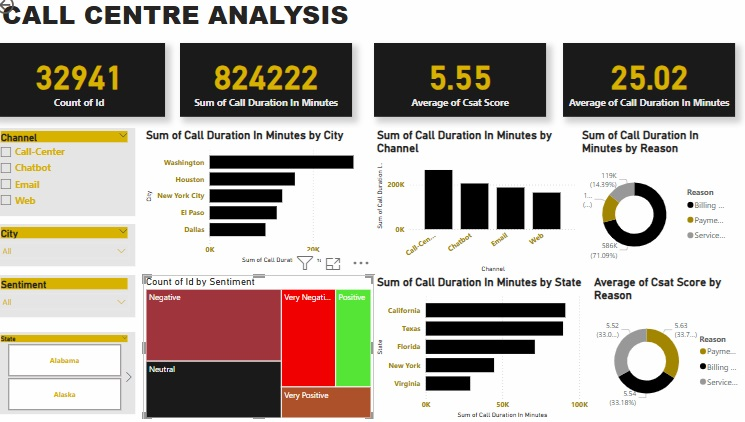

# Call Analysis Report
Call centers play a critical role in customer service for many companies, acting as the primary point of contact between the company and its customers. 
---
# Problem Statement 
The primary objective of this project is to analyze call centre operations to identify key areas for improvement. By leveraging data analytics, the project aims to enhance both efficiency and customer satisfaction. Specific objectives include:
1.	Total Number of calls on each day over the specified period. 
2.	Geographical Analysis on received calls.
3.	Sentimental Analysis on calls. 
4.	Call Centre Breakdown 
5.	The top reasons for calls in relation to inflows of calls 
6.	Channels breakdown and performance rating 
---
# Visualizations 

---

# Insight 

Geographic Disparity in Call Volumes:
Washington emerged as the highest-performing location with a total call duration of 27,861 minutes, significantly outpacing Dallas, which recorded the lowest duration at 10,809 minutes. This represents a 157.8% differential between the top and bottom performers, underscoring a substantial operational or demand gap between these regions.

Dominance of Washington in Total Contribution:
Washington accounted for 33.9% of aggregate call duration, highlighting its disproportionate impact on overall metrics. This suggests either higher customer engagement, larger market presence, or potential resource allocation disparities compared to other locations.

Channel Performance Variability:
Across the four communication channels analyzed, total call duration exhibited a wide range, spanning 164,547 to 266,466 minutes. This variance points to potential imbalances in channel utilization, effectiveness, or customer preference, warranting further investigation into channel-specific strategies.

---
# Recommendations
The analysis reveals critical insights into geographic and channel-based performance trends. Addressing these disparities through targeted strategies could enhance operational efficiency and customer satisfaction metrics enterprise-wide. Further segmentation by time periods, demographics, or call purpose is recommended to refine actionable insights.
